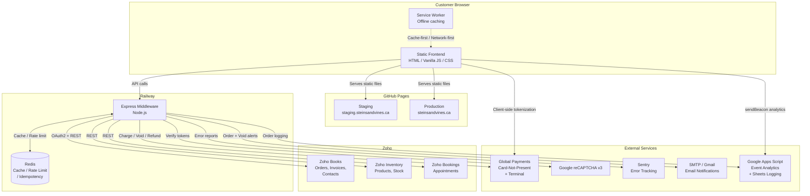
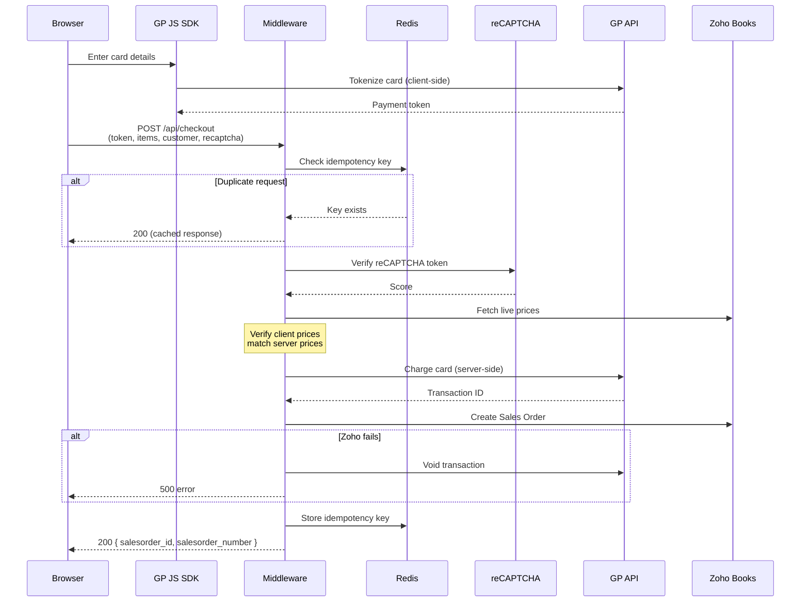
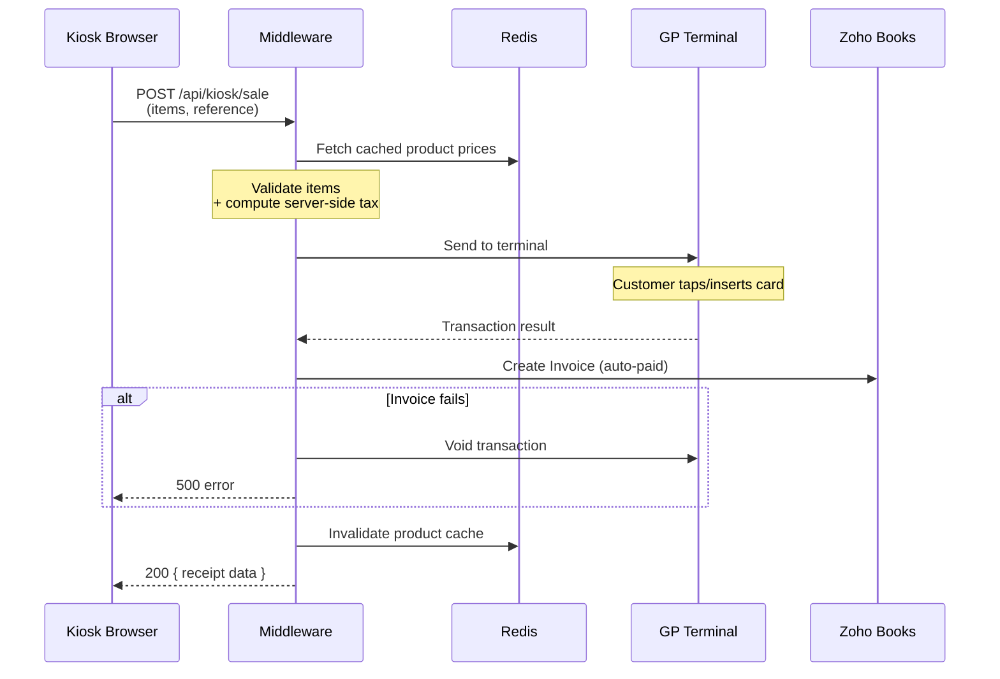

# Architecture — Steins & Vines

## System Overview

## Data Flow: Customer Checkout

This is the most complex flow in the system. It touches nearly every integration.

## Data Flow: Kiosk POS Sale

## Key Architectural Decisions

**Static frontend (no build framework):** The site uses plain HTML and vanilla ES5 JavaScript rather than a framework like React or Vue. This keeps the deployment simple (GitHub Pages), avoids build toolchain complexity, and makes the site fast to load. The trade-off is that frontend modules are concatenated and minified manually via npm scripts.

**Express middleware as an API gateway:** Rather than having the frontend call Zoho and GP APIs directly, all third-party API calls go through the Express middleware. This allows server-side price anchoring (clients can't tamper with prices), credential protection (API keys never reach the browser), and centralized rate limiting, caching, and error handling.

**Server-side price anchoring:** Both the checkout and kiosk flows verify that client-submitted prices match server-fetched Zoho prices. This prevents tampering via browser DevTools or modified API requests.

**Void-on-failure pattern:** If a payment succeeds but the downstream Zoho order creation fails, the middleware automatically voids the GP transaction. This prevents charging customers for orders that don't exist in the business system.

**Dual cart system:** The frontend maintains two separate localStorage carts (`sv-cart-ferment` for fermentation kits, `sv-cart-ingredients` for supplies). This supports the different checkout flows and tax treatments for each product category.

**Redis with graceful degradation:** Redis is used for caching, rate limiting, and idempotency keys, but every Redis-dependent feature degrades gracefully if Redis is unavailable. Rate limiting falls back to per-process memory; catalog requests fall through to Zoho directly.

**Campaign-based testing:** Rather than trying to achieve full test coverage in one pass, testing is organized into campaigns that target specific extractable pure functions. This is documented in TESTING.md with a progress tracker and pattern reference.

## Security Model

| Layer | Mechanism |
|-------|-----------|
| Transport | HTTPS everywhere (GitHub Pages + Railway) |
| CORS | Origin whitelist (production + staging + localhost) |
| Referer | Header check on API-key-protected routes |
| API Key | `X-Api-Key` header on all mutating `/api/*` endpoints |
| reCAPTCHA | v3 verification on public checkout |
| Rate Limiting | Redis-backed per-IP limits (falls back to in-memory) |
| Payment | Client-side tokenization (card data never hits the server) |
| Price Integrity | Server-side price anchoring against Zoho |
| Idempotency | Redis keys prevent duplicate charges |
| OAuth | AES-256-GCM encrypted token storage, auto-refresh via cron |
| Headers | Helmet (CSP, X-Frame-Options, etc. on middleware) |
